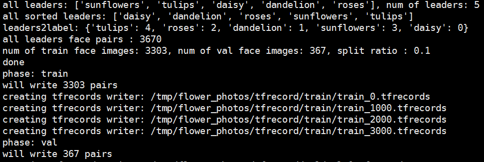
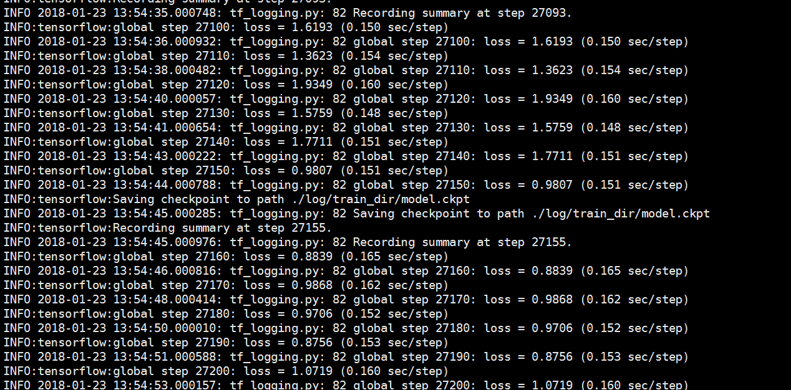
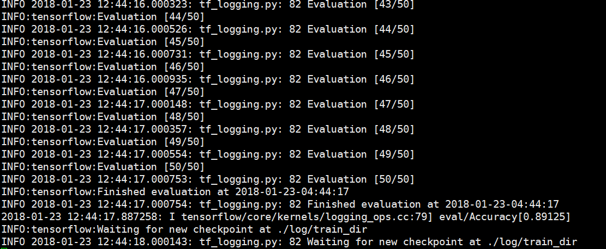
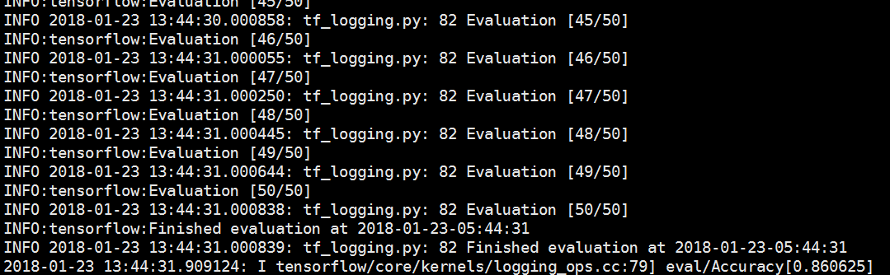
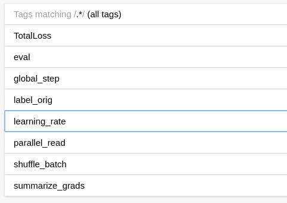
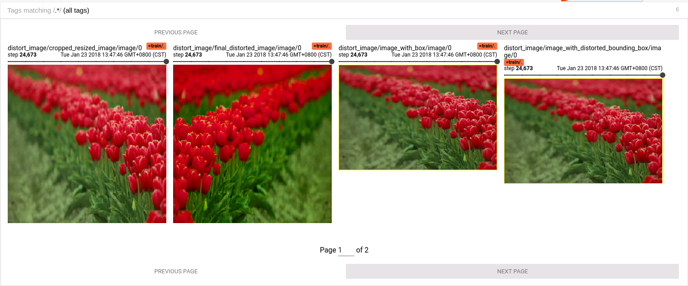
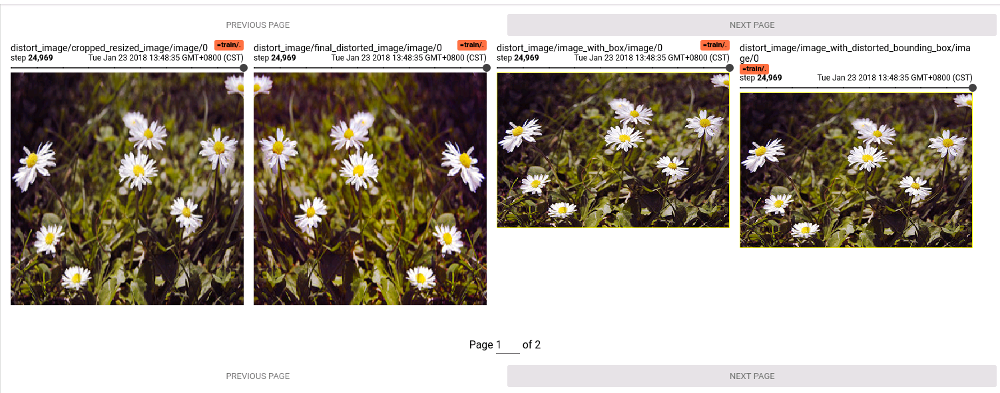
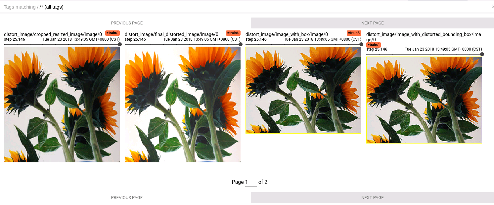
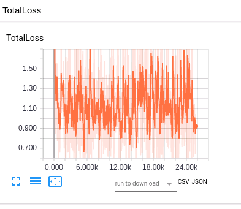
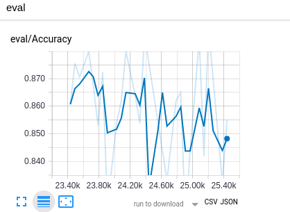

## TF-slim-flowers
Fine-tunes an InceptionV3 model on the Flowers training set.
[InceptionV3 paper](https://arxiv.org/abs/1610.02357))

### Contents
1. [Technology](#Technology)
2. [Structure](#Structure)
3. [Running](#Running)
4. [Demo](#Demo)

## Technology
1. Docker
2. Data parallel read
3. TF-Slim
4. tensorboard
5. TF-distribute 

## Structure
```
.
├── docker-compose.yml
├── Dockerfile // docker build file
├── log 
│   ├── train_dir
│   └── eval_dir
├── nvidia-docker-compose.yml
├── README.md
├── src
│   ├── datasets // generate tfrecord and slim Dataset object 
│   │   ├── __init__.py
│   │   ├── convert_flowers.py //  generate tfrecord
│   │   ├── dataset_utils.py 
│   │   └── flowers.py
│   ├── models // pre-trained model 
│   │   └── inception_v3.ckpt
│   ├── nets // network architecture
│   │   ├── __init__.py 
│   │   ├── inception_utils.py
│   │   ├── inception_v3.py
│   │   ├── inception_v3_test.py
│   │   ├── lenet.py
│   │   └── nets_factory.py
│   ├── preprocessing // data preprecessing
│   │   ├── __init__.py 
│   │   ├── inception_preprocessing.py
│   │   ├── lenet_preprocessing.py
│   │   └── preprocessing_factory.py
│   ├── scriptes
│   │   ├── download_uncompress_flows.sh
│   │   ├── eval_inception_v3_on_flowers.sh
│   │   ├── finetune_inception_v3_on_flowers.sh
│   │   └── unittest.sh
│   ├── common_flags.py // common flags for train/val
│   ├── __init__.py
│   ├── data_provider.py // slim DataProvider object 
│   ├── data_provider_test.py
│   ├── eval.py
│   ├── model.py
│   ├── train.py
│   └── utils.py
└──── screenshots
```
## Running
### Configure environment
1. install [Docker-ce](https://arxiv.org/abs/1610.02357)
2. install [nvidia-docker](https://github.com/NVIDIA/nvidia-docker)(not nvidia-docker2)
3. install [docker-compose](https://docs.docker.com/compose/install/)
4. install [nvidia-docker-compse](https://github.com/eywalker/nvidia-docker-compose)
5. test everything Ok
```
nvidia-docker run --rm nvidia/cuda nvidia-smi
```
### Entering enviroment
```
cd ${ROOT} // suppose ROOT is the root of the project
1. nvidia-docker-compose run --rm --service-ports tf-slim-demo bash
2. nvidia-smi // test OK
```
### run scripts
```
cd src
1. bash ./scripts/unittest.sh
2. bash ./scripts/download_uncompress_flowers.sh
```
### run scripts
```
# create dataset
1. python ./datasets/convert_flowers.py
```

Suppose you have two GPUs(0&1), if not, you must modify training
and evaluation script to prevent them running parallelly.
### run training/evaluation
```
# GPU 0 for training
cd ${ROOT}
bash ./src/scripts/finetune_inception_v3_on_flowers.sh
# GPU 1 for evaluation
bash ./src/scripts/eval_inception_v3_on_flowers.sh
```

### show tensorboard
```
    attention: docker have not its own graphic X server, so it must connect to
    host X-server, there are various way to do this, but I recommend you 
    do this using X11 Socket, see docker-compose.yml for detail
    
    All ready, please open a new Terminal to entery the same container 
    which is running train/evaluation
    
    1. docker exec -it -e DISPLAY=$DISPLAY ${CONTAINER_DIR} bash
    2. tensorboard --logdir=train:./log/train_dir,eval:./log/eval_dir
    3. go to chrome : http://localhost:6006/
    You can get everything you want!
```
## Demo
### screenshots
1. tfrecord

2. train

3. eval


4. tensorboard for summary

5. tensorboard for graph 

6. tensorboard for image



7. tensorboard for TotalLoss

8. tensorboard for eval_accuracy


